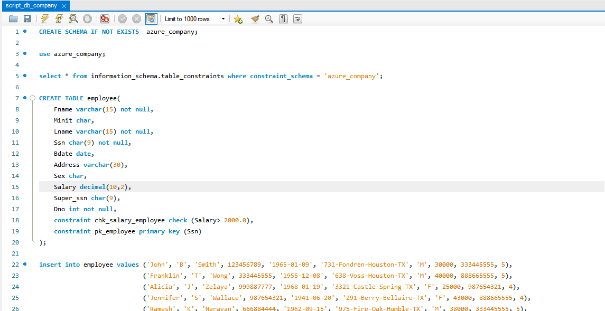
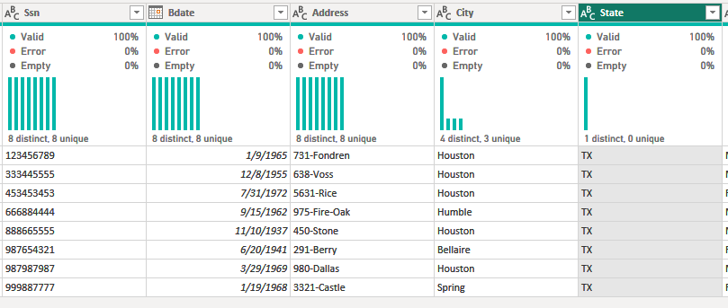
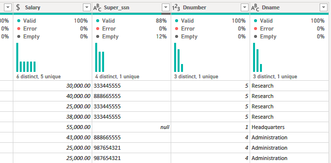
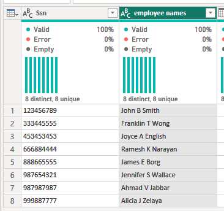
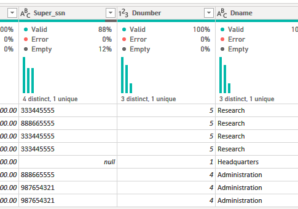
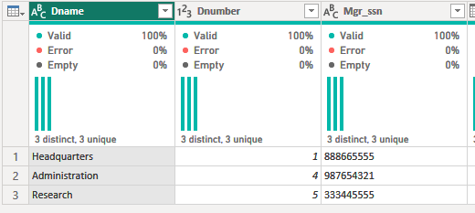
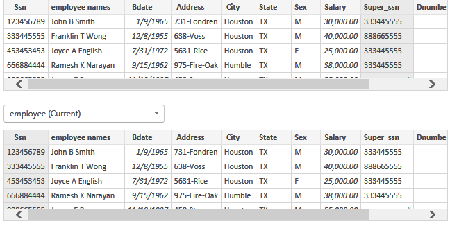
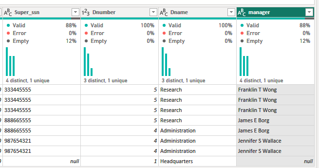
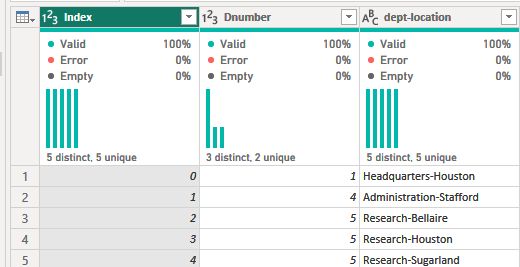

# Resolução do Lab Project: Criando um Dashboard corporativo com integração com MySQL e Azure
## Bootcamp NTT DATA - Engenharia de Dados com Python

### Introdução
Este repositório contém minha solução para o lab project solicitado no Bootcamp NTT DATA - Engenharia de Dados com Python de acordo com suas regras descritas abaixo.

### Tecnologias

### Regras do Lab Project
1. Criação de uma instância na Azure para MySQL  
2. Criar o Banco de dados com base disponível no github  
3. Integração do Power BI com MySQL no Azure  
4. Verificar problemas na base a fim de realizar a transformação dos dados

#### Diretrizes para transformação dos dados:
- Ver arquivo: Desafio de Projeto - Processando e Transformando Dados com Power.docx

### Descrição da Resolução
1. Criação de uma instância na Azure para MySQL - Concluído
2. Banco de dados criado com base no github: https://github.com/joaopaulonsilva/Bootcamp_NTT_DATA_Engenharia_de_Dados/blob/main/Desafios/Criando%20um%20Dashboard%20corporativo%20com%20integra%C3%A7%C3%A3o%20com%20MySQL%20e%20Azure/assets/correcao_script_db_company_e_insercao_de_dados.sql
    - 
    - Arquivo do script salvo em: script_db_company.sql

3. Integração do Power BI com MySQL no Azure - Concluído

4. Transformação dos dados
    - Cabeçalhos e tipos de dados
        - Todas os nomes das tabelas foram revisados, removendo os prefixos com o nome do banco de dados "azure_company"
        - Os cabeçalhos foram revisados adequando alguns nomes:
            - As colunas referentes ao número do departamento foram todas renomeadas como "Dnumber"
            - As colunas referentas ao número do projeto foram todas renomeadas como "Pnumber"
        - Os tipos de dados foram analisados, mas nenhuma inconsistência foi encontrada:
            - Textos e números adequados
            - As datas com o tipo "DATE" coerentes às necessidades de análise
            - revisão do tipo de dado da coluna de salário de "DECIMAL NUMBER" para "Fixed DECIMAL NUMBER"
    
    - Valores nulos:
        - Não foram encotrados valores nulos que estivessem incoerentes com a finalidade das tabelas.
        - Em "employee" apenas o colaborador James Borg, apresenta valor nulo em Super_ssn - pode ser que seja o responsável pela empresa, já que seu número aparece como sendo o gerente de outros colaboradores
    
    - Não há departamento sem gerente

    - Número de horas dos projetos
        - Chama a atenção que apenas uma única linha de projeto apresenta zero na coluna horas:
            - Projeto número 20 - Reorganization
            - Refere-se ao colaborador 888665555 - James E Borg, que é um gestor  
            - Pode ser um erro, ou esse gestor foi recentemente alocado ao projeto e este dado não foi atualizado no sistema.
            - Outros colaboradores já têm horas listadas neste mesmo projeto.

    - Separação de Colunas complexas:
        - Observado apenas uma coluna complexa referente ao endereço ("Address") na tabela "employee"
            - Para melhorar as possibilidades de análise do banco de dados, filtrando por exemplo cidade e estado esta coluna foi separada em: endereço/ cidade/ estado.
            

    - Mesclar consultas employee e departament para obter a tabela employee com o nome dos depatamentos:
        
    
    - Mesclar o nome e sobrenome dos colaboradores:  
        
    
    - Junção dos colaboradores e respectivos nomes dos gerentes:
        - Percebi uma pequena inconsistência nos dados dos gerentes cruzando o Supper_SSn como a coluna Mgr_ssn na tabela de departamentos
         
        - Na tabela employee os códigos dos gerentes não correspondem totalmente aos gerentes dos departamentos - pode ser erro, ou diferentes níveis hierárquicos.
        - Nesta construção, considerei o Super_ssn como os colaboradores que têm algum nível de gestão e, portanto, inclui o nome o gestor baseado nesta coluna.
        - Como não há uma tabela apenas com o nome dos gerentes, resolvi o nome do gestor mesclando as colunas Super_ssn e Ssn na mesma tabela, expandindo o resultado para mostrar o nome do colaborador e renomeei a coluna para "manager"
             

    - Mesclar os nomes de departamentos e localização, para que cada combinação departametno-local seja único. Isso irá auxiliar na criação do modelo estrela em um módulo futuro.
        - Para mesclar os nomes, primeiramente mesclei a coluna com o nome do departamento na tabela "dept_location"
        - Colunas mescladas com o padrão: nome_departamento-local
        - Confirmei que havia apenas uma combinação nome_dep-local e incluí um índice.
            

    - Explicando porque devemos utilizar o mesclar e não o atribuir:
        - Mesclar e atribuir têm finalidades diferentes no Power Query:
            - Mesclar: combina duas tabelas (ou uma única tabela) baseando-se em uma coluna em comum (referência) - funciona como o JOIN no SQL. Há uma combinação horizontal dos dados.
            
            - Atribuir: é usado para adicionar linha de uma tabela a outra -- funciona como o UNION no SQL. Combina os dados (verticalmente) - linhas são adicionadas acomodando os dados de ambas tabelas.

5. Descrição dos arquivos do repositório:
    - Os arquivos deste repositório correspondem às minhas soluções para este desafio de projeto:
        - relatorio_corporativo-MySQL.pbix.pbix => arquivo Power BI - minha versão do relatório objeto deste Lab Project, incluindo análise preliminar sobre a característica da empresa em relação à sua constituição, departamento pessoal, projetos, composição distribuição da equipe e salários.
        - Os arquivos de imagems são print-screen dos processo descritos neste README. 

